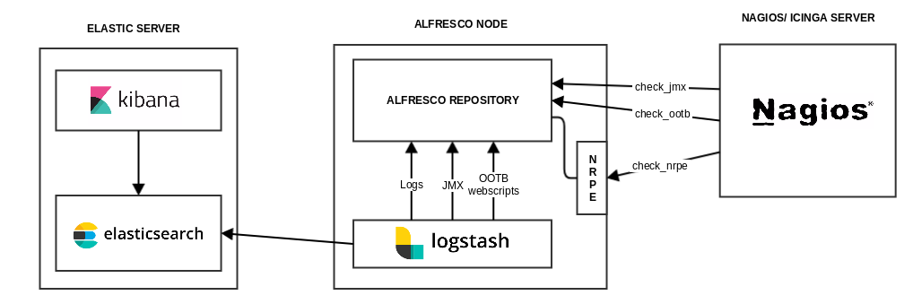

# Alfresco Devcon 2018

The materials for the lighting talk presentation are linked here:

## Lighting Talk Session

### Alfresco monitoring setups with Nagios and ELK stack using JMX and OOTB Support tools

## About the author

Cesar Capillas is IT/Solution Architect at zylk.net, an OOTB member working with Alfresco-based solutions during the last 8 years in large organisations. He is the author of a corporate Alfresco Blog, addons developer and a very active user in Alfresco Community.

 - Linkedin Profile - https://www.linkedin.com/in/cesarcapillas/
 - Company Website  - http://www.zylk.net/es/home
 - Alfresco Blog    - http://www.zylk.net/alfresco-blog

## Related links

- [ELK setup for Alfresco](https://github.com/zylklab/alfresco-elk)
- [Nagios setup for Alfresco](https://github.com/zylklab/alfresco-nagios)
- [Alfresco Devcon 2018](https://devcon.alfresco.com/)

## Related posts

- [Kibana dashboard for monitoring Alfresco JMX metrics](https://www.zylk.net/es/web-2-0/blog/-/blogs/kibana-dashboard-for-monitoring-alfresco-jmx-metrics)
- [Kibana dashboard for monitoring Alfresco Logs](https://www.zylk.net/es/web-2-0/blog/-/blogs/simple-kibana-dashboard-for-monitoring-alfresco-logs)
- [Kibana dashboard for monitoring Alfresco CE via OOTB Support Tools](https://www.zylk.net/es/web-2-0/blog/-/blogs/kibana-dashboard-for-monitoring-alfresco-community-via-ootb-support-tools)
- [Nagios setup for Alfresco CE](https://www.zylk.net/es/web-2-0/blog/-/blogs/basic-nagios-setup-for-alfresco-community)
- [Docker Image for Nagios setup for Alfresco CE](https://www.zylk.net/es/web-2-0/blog/-/blogs/docker-image-for-nagios-setup-for-alfresco-community)
- [Enabling JMX in Alfresco](https://www.zylk.net/es/web-2-0/blog/-/blogs/enabling-jmx-in-alfresco)
